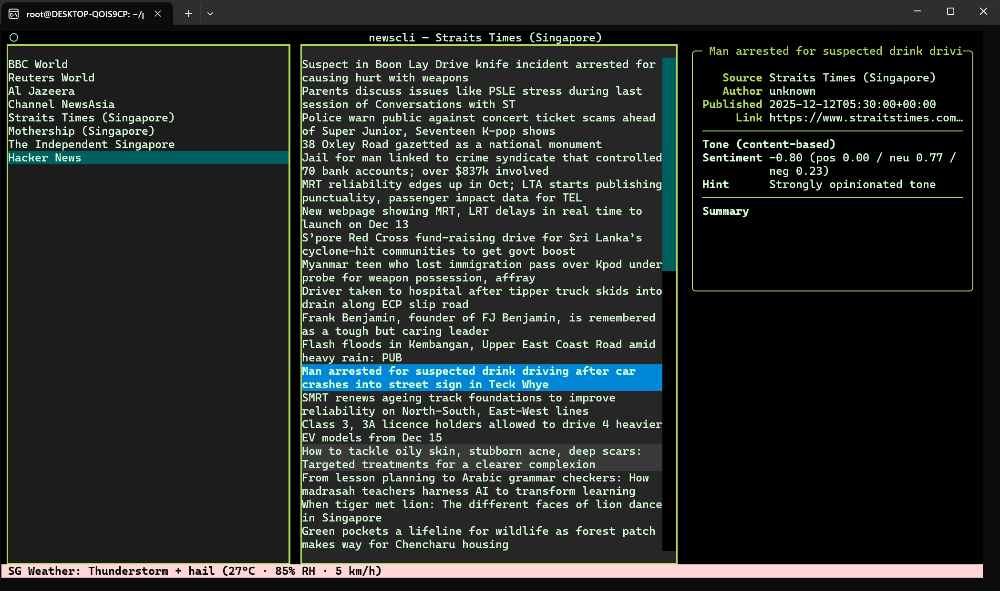
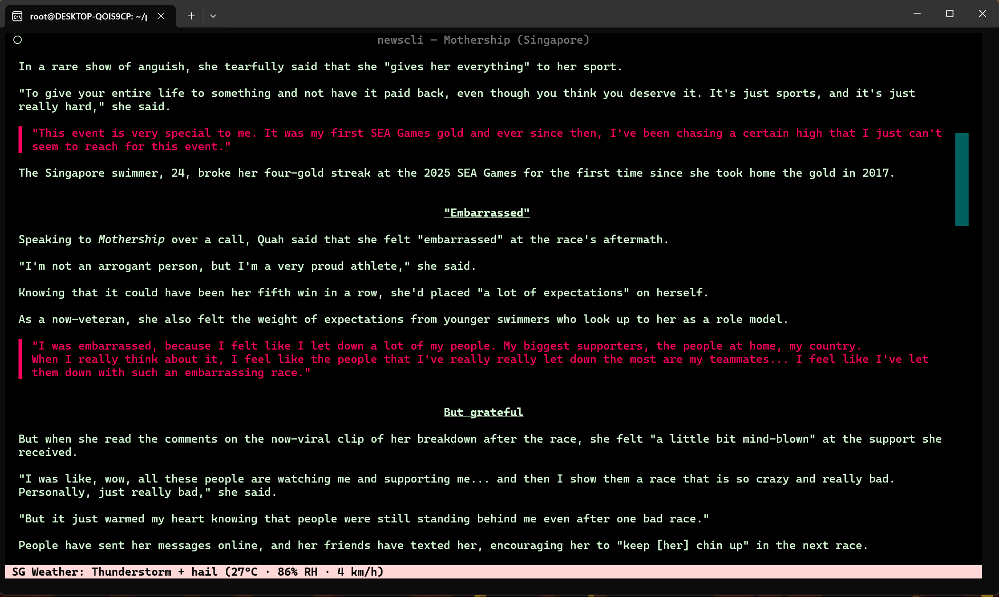

 # newscli
 
 A terminal TUI news reader that pulls from RSS feeds, shows authors when available, and provides lightweight **content-based** heuristics about tone/subjectivity.
 
 It does **not** scrape personal background information (e.g., LinkedIn). If you want to research an author, the app only generates search links you can open yourself.
 
 ## Install
 
```bash
pip install .
```

Editable installs may work too if your pip/setuptools support it:

```bash
pip install -e .
```
 
 ## Run
 
 ```bash
 news
 ```

## Screenshots

Main feed view with sources, articles, and detail pane:



Article reader view with Rich formatting and SG weather/time bar:


 
 ## Keys
 
- `↑/↓` or `j/k`: move
- `enter`: open selected article reader
- `b`: open selected article in browser
- `r`: refresh current source
- `a`: show author research links
- `q`: quit
 
## Sources
 
 Default sources are built in. You can add your own RSS feeds in:
 
 `~/.config/newscli/sources.json`
 
Example:
 
 ```json
 [
   {"name": "My Blog", "url": "https://example.com/rss.xml"},
   {"name": "Tech News", "url": "https://news.ycombinator.com/rss"}
 ]
 ```

## Full-article fetching notes

- This app fetches full articles only from sites that allow normal HTTP access. Some outlets block in-app readers or require a subscription; in those cases you’ll see the RSS summary and can press `b` to open a browser.
- **Optional mirror fallback (off by default):** to try a text mirror when a site returns `403/429`, set:

```bash
export NEWSCLI_MIRROR_ON_403=1
news
```

This uses the Jina AI mirror (`r.jina.ai`) and may violate some sites’ terms of service. Enable it only if you’re comfortable with that tradeoff.
# newstui
